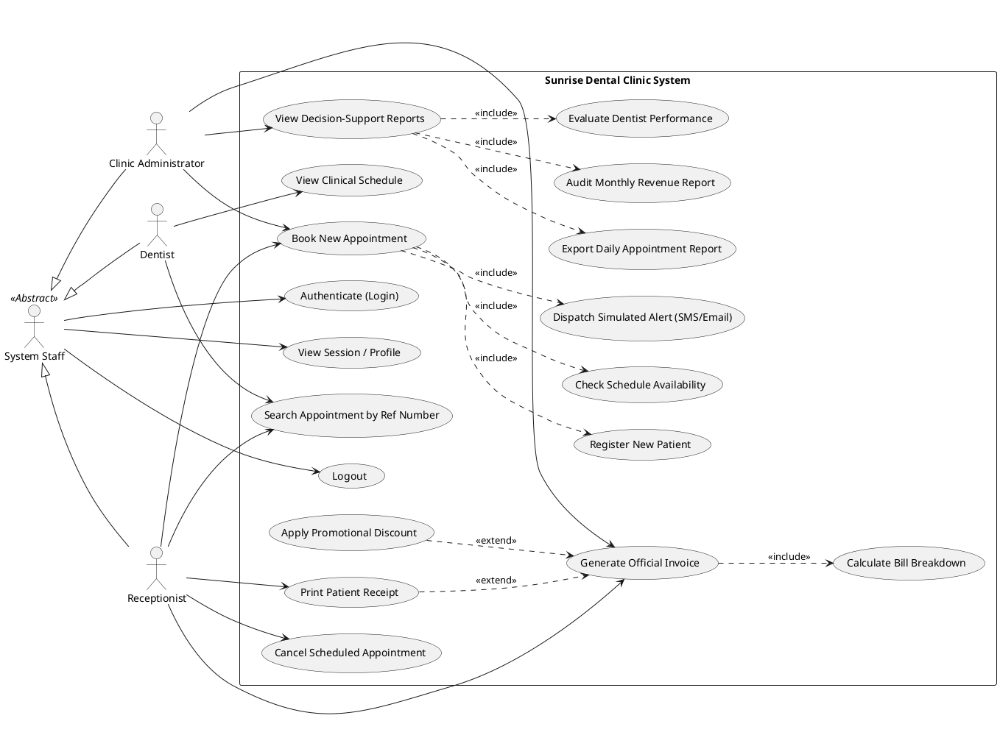
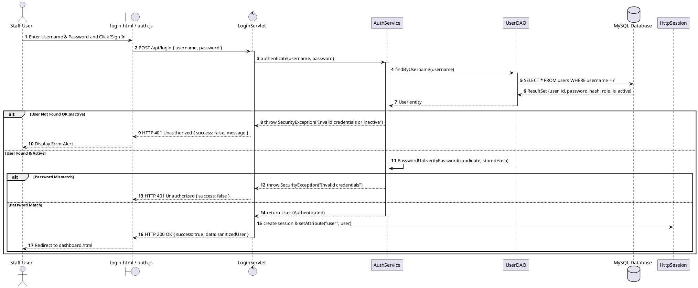
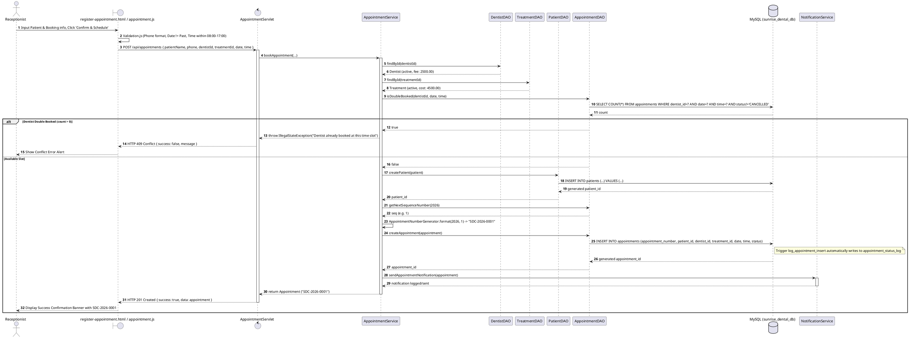
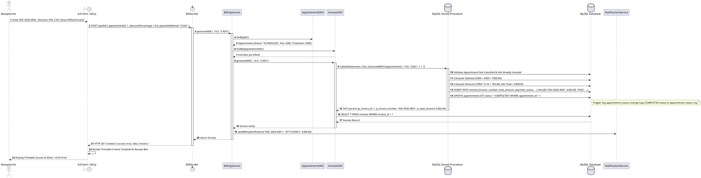
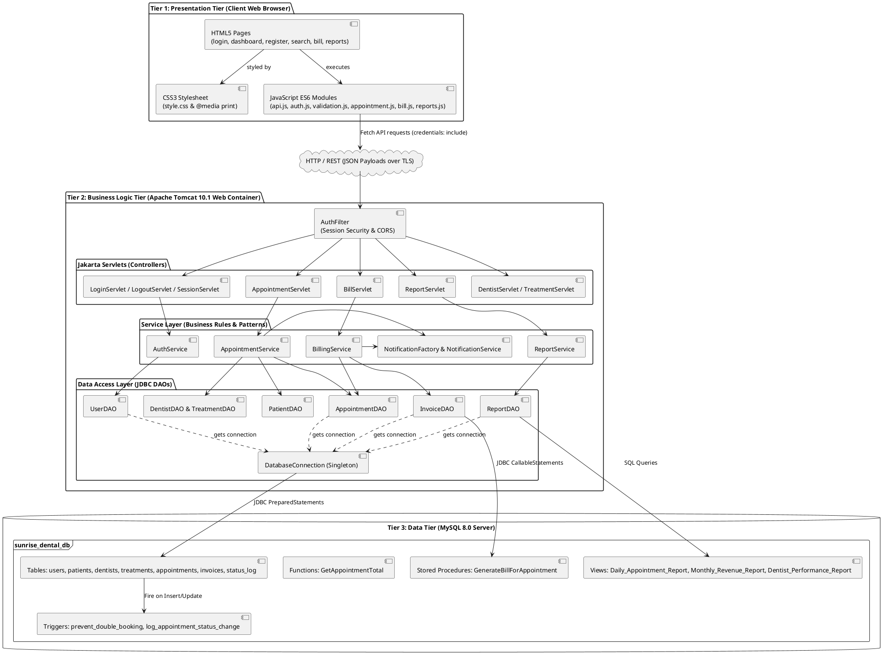

# 📐 PlantUML Design Models — Sunrise Dental Clinic

**Module:** CIS6003 Advanced Programming  
**Document:** Complete UML Specifications (Targeting Excellent 70–100% Grade Band)

---

## 1. Use Case Diagram

---

## 2. Complete Class Diagram

```plantuml
@startuml
skinparam classAttributeIconSize 0
skinparam defaultFontName Arial
skinparam shadowing false

package "Model Layer" {
    class User {
        - userId : int
        - username : String
        - passwordHash : String
        - fullName : String
        - role : String
        - active : boolean
        - createdAt : Timestamp
        - updatedAt : Timestamp
        + getUserId() : int
        + getUsername() : String
        + getRole() : String
        + isActive() : boolean
    }

    class Patient {
        - patientId : int
        - patientName : String
        - address : String
        - contactNumber : String
        - email : String
        - createdAt : Timestamp
        + getPatientId() : int
        + getPatientName() : String
        + getContactNumber() : String
    }

    class Dentist {
        - dentistId : int
        - userId : Integer
        - dentistName : String
        - specialization : String
        - consultationFee : BigDecimal
        - contactNumber : String
        - active : boolean
        + getDentistId() : int
        + getConsultationFee() : BigDecimal
        + getDentistName() : String
    }

    class Treatment {
        - treatmentId : int
        - treatmentName : String
        - description : String
        - cost : BigDecimal
        - active : boolean
        + getTreatmentId() : int
        + getCost() : BigDecimal
        + getTreatmentName() : String
    }

    class Appointment {
        - appointmentId : int
        - appointmentNumber : String
        - patientId : int
        - dentistId : int
        - treatmentId : int
        - appointmentDate : Date
        - appointmentTime : Time
        - status : String
        - notes : String
        - createdAt : Timestamp
        + getAppointmentNumber() : String
        + getStatus() : String
        + setStatus(status : String) : void
    }

    class Invoice {
        - invoiceId : int
        - invoiceNumber : String
        - appointmentId : int
        - consultationFee : BigDecimal
        - treatmentCost : BigDecimal
        - discountPercentage : BigDecimal
        - discountAmount : BigDecimal
        - totalAmount : BigDecimal
        - paymentStatus : String
        - paymentMethod : String
        - createdAt : Timestamp
        + getInvoiceNumber() : String
        + getTotalAmount() : BigDecimal
    }

    class ApiResponse<T> {
        - success : boolean
        - message : String
        - data : T
        + ok(msg : String, data : T) : ApiResponse<T>
        + error(msg : String) : ApiResponse<T>
    }
}

package "Data Access Object (DAO) Layer" {
    class UserDAO {
        + findByUsername(username : String) : User
        + findById(userId : int) : User
        + createUser(user : User) : int
    }

    class PatientDAO {
        + findById(id : int) : Patient
        + findByContactNumber(contact : String) : Patient
        + createPatient(patient : Patient) : int
    }

    class DentistDAO {
        + findAllActive() : List<Dentist>
        + findById(id : int) : Dentist
    }

    class TreatmentDAO {
        + findAllActive() : List<Treatment>
        + findById(id : int) : Treatment
    }

    class AppointmentDAO {
        + createAppointment(app : Appointment) : int
        + findByAppointmentNumber(num : String) : Appointment
        + isDoubleBooked(dentistId : int, d : Date, t : Time, exId : Integer) : boolean
        + getNextSequenceNumber(year : int) : int
        + updateStatus(id : int, status : String) : boolean
    }

    class InvoiceDAO {
        + generateBill(appId : int, discount : BigDecimal, method : String) : Invoice
        + findByAppointmentNumber(appNum : String) : Invoice
        + findByAppointmentId(appId : int) : Invoice
    }

    class ReportDAO {
        + getDailyAppointmentReport() : List<ReportItem>
        + getMonthlyRevenueReport() : List<ReportItem>
        + getDentistPerformanceReport() : List<ReportItem>
    }
}

package "Service Layer" {
    class AuthService {
        - userDAO : UserDAO
        + authenticate(username : String, pass : String) : User
        + registerUser(u : String, p : String, n : String, r : String) : User
    }

    class AppointmentService {
        - appointmentDAO : AppointmentDAO
        - patientDAO : PatientDAO
        - dentistDAO : DentistDAO
        - treatmentDAO : TreatmentDAO
        - emailNotifier : NotificationService
        - smsNotifier : NotificationService
        + bookAppointment(name : String, addr : String, phone : String, email : String, dId : int, tId : int, date : Date, time : Time, notes : String) : Appointment
        + getAppointmentByNumber(num : String) : Appointment
        + updateAppointmentStatus(id : int, status : String) : boolean
    }

    class BillingService {
        - invoiceDAO : InvoiceDAO
        - appointmentDAO : AppointmentDAO
        - smsNotifier : NotificationService
        + generateBill(appId : int, discount : BigDecimal, method : String) : Invoice
        + getInvoiceByAppointmentNumber(num : String) : Invoice
    }

    interface NotificationService {
        + sendAppointmentNotification(app : Appointment) : boolean
        + sendBillingNotification(appNum : String, phone : String, amount : double) : boolean
    }

    class EmailNotificationService implements NotificationService
    class SmsNotificationService implements NotificationService

    class NotificationFactory {
        + {static} getNotificationService(channel : Channel) : NotificationService
    }
}

package "Configuration & Utility Layer" {
    class DatabaseConnection <<Singleton>> {
        - {static} instance : DatabaseConnection
        - driver : String
        - url : String
        - username : String
        - password : String
        - DatabaseConnection()
        + {static} getInstance() : DatabaseConnection
        + getConnection() : Connection
    }

    class PasswordUtil {
        + {static} hashPassword(plain : String) : String
        + {static} verifyPassword(candidate : String, hash : String) : boolean
    }

    class ValidationUtil {
        + {static} isValidPhoneNumber(phone : String) : boolean
        + {static} isWithinClinicHours(time : Time) : boolean
        + {static} isFutureOrTodayDate(date : Date) : boolean
    }

    class AppointmentNumberGenerator {
        + {static} format(year : int, seq : int) : String
    }
}

' Multiplicity & Structural Relationships
Patient "1" *-- "0..*" Appointment : books >
Dentist "1" o-- "0..*" Appointment : attends >
Treatment "1" o-- "0..*" Appointment : prescribes >
Appointment "1" *-- "0..1" Invoice : settles into >
User "0..1" -- "1" Dentist : associates >

AppointmentService o-- AppointmentDAO
AppointmentService o-- PatientDAO
AppointmentService o-- DentistDAO
AppointmentService o-- TreatmentDAO
AppointmentService o-- NotificationService

BillingService o-- InvoiceDAO
BillingService o-- AppointmentDAO

AuthService o-- UserDAO

@enduml
```

---

## 3. Sequence Diagram 1: Staff Authentication (Login)

---

## 4. Sequence Diagram 2: Register New Patient Appointment

---

## 5. Sequence Diagram 3: Calculate & Generate Invoice Bill

---

## 6. Distributed 3-Tier Architecture Diagram

